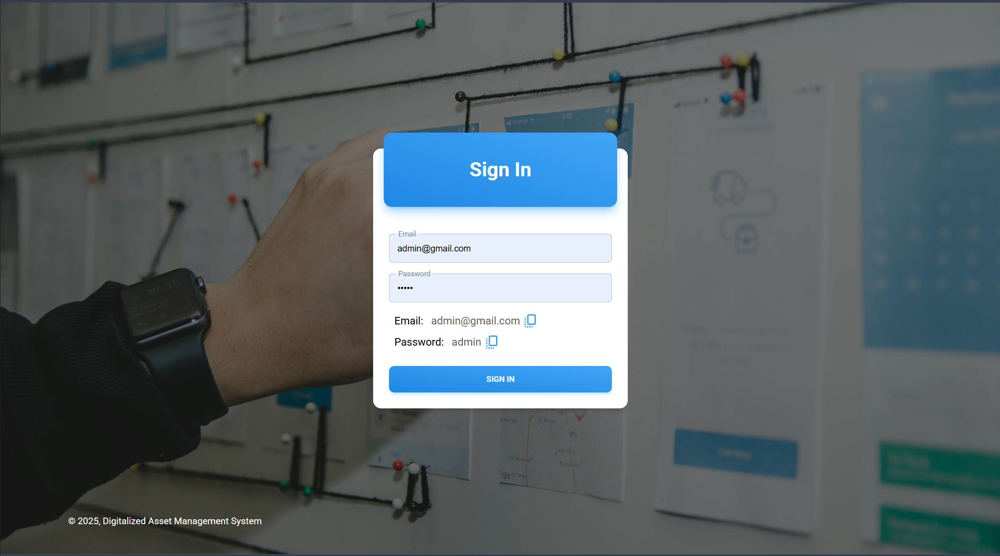

# 🧭 ADMIN Dashboard One (React + Vite)

A sleek, responsive admin dashboard built with React 18 and Vite, featuring a combination of MUI, Mantine, Material Tailwind, and other modern UI frameworks. Designed for complex internal tools and dashboards with charts, tables, and form-heavy interactions.

> ⚡ Live Demo: [https://dashboard-one-preview.vercel.app](https://dashboard-one-preview.vercel.app)

---

## 📸 Preview



---

## 🚀 Features

- ⚡ **Vite** for blazing fast builds
- 🎨 **MUI**, **Mantine**, and **Material Tailwind** for beautiful UIs
- 📊 **ApexCharts** for visual analytics
- 🗓️ **Day.js**, **Moment**, and **Ethiopian Date** support
- 🔐 **JWT-based auth** with cookies
- ✅ **Form validation** using Formik + Yup
- 🔁 **React Redux Toolkit** for state management
- 📦 **Dynamic Tables**, **Print Support**, **QR Code generation**, and more
- 🧠 Code-splitting and lazy-loading support

---

## 🛠 Tech Stack

| Stack        | Library / Tool                |
|--------------|-------------------------------|
| Frontend     | React 18 + Vite               |
| Styling      | Tailwind CSS, MUI, Mantine    |
| Forms        | Formik, Yup                   |
| State Mgmt   | Redux Toolkit                 |
| API          | Axios                         |
| Charts       | ApexCharts + react-apexcharts |
| Auth         | JWT, js-cookie                |
| Routing      | React Router DOM              |
| Utils        | Moment, Day.js, QRCode        |

---


## 📂 Folder Structure (Typical)

```bash 
src/
├── assets/images # Static images
├── components # Reusable UI components
├── configs # Global configuration constants
├── context # React context providers
├── css # Tailwind/global styles
├── data # Static/mock data
├── functions # Utility functions
├── http # Axios/API setup
├── layouts # Page layout components
├── pages # Route-based pages
├── tables # Table configuration and rendering
├── widgets # Dashboard widgets/cards
├── App.jsx # App root component
├── main.jsx # App entry point
└── routes.jsx # App routing config
```

---

## 🧑‍💻 Getting Started

### 1. Clone the repo

```bash
git clone https://github.com/natnaelengeda/dashboard-one-preview.git
cd dashboard-one-preview
```

### 2. Install dependencies

```bash
npm install
# or
yarn
```

### 2. Start development server

```bash
npm run dev
# or
yarn dev
```

### 3. Environment Variables
Create a `.env` file in the root directory and add your environment variables:

```env
NODE_ENV=
VITE_SERVER_URL=
VITE_API_KEY=
```

# 👤 Author

**Natnael Engeda**

- 💻 Full Stack Developer (React, Node, Flutter, Laravel)
- 🌍 Based in Ethiopia
- 🔗 Portfolio: [https://www.natnaelengeda.tech](https://www.natnaelengeda.tech)
- 🧑‍💼 LinkedIn: [linkedin.com/in/natnaelengeda](https://www.linkedin.com/in/natnaelengeda)
- 🐙 GitHub: [github.com/natnaelengeda](https://github.com/natnaelengeda)
- 📧 Email: nattynengeda@gmail.com
- 📞 Phone: +251 936 657 001

---

This project is maintained and actively developed by Natnael.  
Feel free to reach out for collaborations, freelance work, or hiring opportunities.

# 🙌 Acknowledgements

This project wouldn't be possible without the amazing open-source tools and communities that power the modern web. Big thanks to:

- [React](https://reactjs.org/) – A JavaScript library for building user interfaces
- [Vite](https://vitejs.dev/) – Next-generation frontend tooling
- [Tailwind CSS](https://tailwindcss.com/) – Utility-first CSS framework
- [Material UI](https://mui.com/) – React UI framework with design system
- [Mantine](https://mantine.dev/) – A modern component library for React
- [Redux Toolkit](https://redux-toolkit.js.org/) – Standard approach to writing Redux logic
- [ApexCharts](https://apexcharts.com/) – Modern charting library
- [Formik](https://formik.org/) – Form management for React
- [Yup](https://github.com/jquense/yup) – Schema builder for value parsing and validation
- [js-cookie](https://github.com/js-cookie/js-cookie) – Simple JavaScript API for handling cookies
- [React Router](https://reactrouter.com/) – Declarative routing for React apps

Thank you to the developers, maintainers, and contributors of these incredible tools! ❤️


## 📄 License

This project is licensed under the **MIT License** — see the [LICENSE.md](./LICENSE.md) file for details.

© 2025 [Natnael Engeda](https://github.com/natnaelengeda)